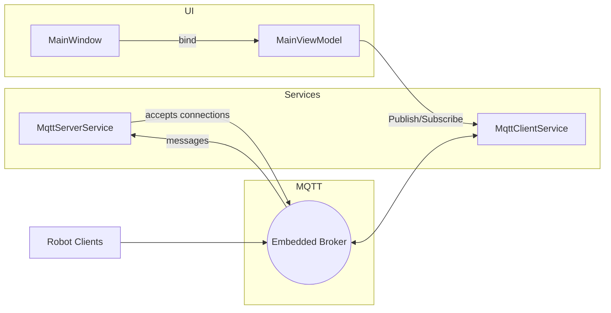

**Arsitektur Perangkat Lunak — FMR.AisinAMR**

Overview
- Aplikasi desktop WPF (.NET 10) menggunakan pola MVVM.
- UI: MaterialDesign (MaterialDesignThemes + MaterialDesignColors).
- Komunikasi realtime menggunakan MQTT (embedded broker + managed client).

Komponen utama
- Views: tampilan XAML (`Views/*`) — shell `MainWindow.xaml` dan modular views.
- ViewModels: `ViewModels/MainViewModel.cs` mengatur lifecycle service dan navigasi.
- Services:
  - `Services/MqttServerService.cs` — embedded MQTT broker, event publik: `ServerStatusChanged`, `MessageReceived`, `ClientConnected`, `ClientDisconnected`.
  - `Services/MqttClientService.cs` — managed client untuk subscribe/publish.
- Models: `Models/RobotStatus.cs`, payload classes (`NavGoal`, `RobotIdentity`, dll.).
- Converters: `Converters/Converters.cs`, `Converters/PageNameToVisibilityConverter.cs`.
- Resources: warna, style di `App.xaml`.

Topologi MQTT
- Broker ter-embed mendengarkan pada port konfigurasi (cek `MqttServerService`).
- Topik yang digunakan contoh:
  - `amr/{robotId}/status/pose` — pose (x,y,yaw)
  - `amr/{robotId}/status/health` — battery, plc_ok, heartbeat, nav_state
  - `amr/{robotId}/event/{type}` — event seperti `arrived`, `error`
  - `amr/{robotId}/cmd/goal` — perintah navigasi (dikirim dari UI ke robot)
  - `amr/{robotId}/cmd/estop` — emergency stop
  - `amr/{robotId}/cmd/cancel` — batalkan goal

Alur data
1. Robot terhubung ke embedded broker dan mengirim status/event.
2. `MqttServerService` menerima pesan → memicu event `MessageReceived`.
3. `MainViewModel` menangani event, mem-parsing payload (Newtonsoft.Json) → update `RobotStatus`.
4. UI (via data binding) merefleksikan status realtime.
5. Perintah user (SendNavGoal / SendEStop / SendCancel) dipublish melalui `MqttClientService`.

Diagram arsitektur (mermaid):

Keamanan & desain
- Broker lokal memudahkan pengujian; untuk produksi pertimbangkan broker terpisah (Mosquitto) dan TLS.
- Pesan saat ini tidak terenkripsi — gunakan TLS dan autentikasi jika jaringan produksi.

Skalabilitas
- Saat menambah fleet, buat `ObservableCollection<RobotStatus>` di `MainViewModel` dan perender list di `FleetView`.
- Untuk banyak klien, lebih baik memisahkan broker ke server terdedikasi.
